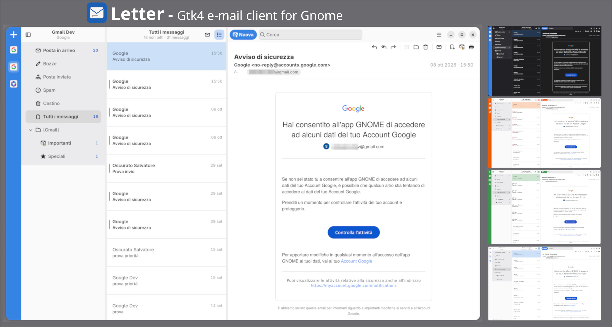

# Letter

[](https://github.com/stalvatero/letter/actions/workflows/ci.yml)

Letter is a GTK 4 and libadwaita email client for the GNOME desktop. It sits next to Calendar and Contacts and uses the same identities: **GNOME Online Accounts** for login, **Evolution Data Server** and Camel for mail.



This is not a GNOME Core application, but it follows the clean GNOME 50 look and feel.

Feel free to try it out and enjoy the app's potential. All feedback is welcome.

**1.0.0** is the current release. Reading, composing, search, notifications, and cache-first sync are in place. Install the Flatpak from [Releases](https://github.com/stalvatero/letter/releases). Account setup still happens only in GNOME Settings → Online Accounts. There is no in-app IMAP wizard and no mailbox that exists only inside Letter.

### Available languages

- English
- Italian
- German (translation by [Christian Lauinger](https://github.com/ChrisLauinger77))
- Brazilian Portuguese (translation by [Thiago Haeitmann](https://github.com/ThiagoHaeitmann))
- More will come — translations via pull request are very welcome.


## What the current version does:


### Accounts and desktop integration

- Discovers Google, Microsoft 365, Exchange, IMAP/SMTP from GNOME Online Accounts and Evolution Data Server
- No second account wizard and no local unnecessary “On this computer” mailbox
- Account rail with provider icons and fast switch between the enabled email accounts
- Per-account HTML multi-signatures, with a starred default for new messages


### Reading

- Adaptive three-pane shell (accounts and folders, message list, reader)
- Conversation grouping, unread filter, bookmarks (compatible with flagged Outlook emails or starred Gmail emails)
- Customizable reading pane on the right, below the list, or hidden
- HTML bodies in WebKit; zoom shortcuts (Ctrl+, Ctrl-, Ctrl0 and Ctrl+mousewheel) enabled and applies to the message body only
- Remote images only from senders you trust (Microsoft 365 also trusts your organisation and address book)
- Attachments, with quick preview through GNOME Sushi when it is installed
- Calendar invitations in the reading pane, with Accept and Reject options
- Print allowed, and “View image” from the message context menu on inline image
- Customizable mark as read on selection, after a delay, or never


### Sync and local cache

- After the first full sync, Letter prefers the **local cache** for folder lists, headers, bookmarks, and unread badges so the UI stays responsive
- Opening a folder reads from cache; the server is checked on the interval you set in Preferences (and when you refresh), not on every click
- At startup and on each sync cycle, Letter still probes non-Inbox folders lightly: empty lists that have mail on the server, or lists whose remote counts drifted (for example mail filed from a phone)
- Archive, trash, move, and flag changes update the UI immediately; the server push waits for the sync timer, F5, startup, or quit (so Send stays responsive)
- Pending soft changes survive a quit, crash or offline working in a small on-disk registry and flush on the next start
- Sending uses a virtual **Outbox** (retry / edit / cancel);


### People

- The people button in the folder pane switches it from folders to the people you exchange mail with, sorted by your most recent exchange, with unread badges
- Pick a person to see their mail to you and yours to them as conversations, whichever folder it sits in, including Sent and archives; mail on which they are only on Cc belongs to its sender
- **All People** at the top shows all your mail at once
- Filter the list by name or address; right-click a person to write to them or copy their address
- Junk, Trash and Drafts are left out


### Search

- Search as you type in the current folder
- Operator localized chips: `from:`, `to:` `cc:`, and **contains:** as the default when you press Enter


### Composing

- New message, reply, reply all, forward, and **send again**
- HTML editor with a compact format toolbar
- Automatic links for email addresses and URLs; remove a link from the context menu
- Hunspell spell checking, including “Add to Dictionary” (may require additional package of your choice if not installed)
- Insert image inline, resize from the format toolbar (or the context menu). You can also insert image by drag-and-drop from your PC
- Address book picker from Online Accounts and recent recipients, drag recipient pills
- When you reply and add a new recipient, Letter can offer to attach files from the original message
- Save drafts


### Keyboard

Keyboard shortcuts can be viewed by pressing F1 or via the Letter main menu.

### Notifications and preferences

- Desktop notifications for new mail, with archive and delete actions
- Optional notification sound
- Light, dark, or follow the system colour and accent.
- Sync interval and how many days of bodies to keep locally
- Preferences page for recommended packages and how to install them


## What it needs

Letter is built for the **GNOME desktop**. A normal GNOME 50 install already has the libraries the binary links against. See **Where it runs** below.

You must add at least one email account in **Settings → Online Accounts**. IMAP/SMTP are added there too, not inside Letter application. Without Online Accounts, there is nothing to show.

For a Microsoft 365 mailbox, install `evolution-ews` on the system as well. Online Accounts can sign you in without it, but Evolution Data Server only publishes the mail source when that package is present. Letter then waits and shows the account as not ready. The Flatpak carries its own copy of the same library, and that is the one Letter uses to download mail. IMAP does not need this package.

```
Arch Linux
sudo pacman -S evolution-ews

Debian / Ubuntu
sudo apt install evolution-ews

Fedora
sudo dnf install evolution-ews
```

`evolution-ews` also installs the Evolution application, which Calendar and Contacts use for the same Microsoft account. You do not need to run Evolution for Letter. Leave it closed so only Letter downloads messages. To hide it from the app grid:

```sh
mkdir -p ~/.local/share/applications && cp /usr/share/applications/org.gnome.Evolution.desktop ~/.local/share/applications/ && echo "NoDisplay=true" >> ~/.local/share/applications/org.gnome.Evolution.desktop

update-desktop-database ~/.local/share/applications
```

Tip: Use the **Microsoft 365** (Graph) account type, not classic Exchange Web Services. Microsoft starts blocking EWS on Exchange Online on 1 October 2026.

For the full experience, **Hunspell** and **Sushi** are recommended. Hunspell (package name `hunspell` and `hunspell-en_us` or `hunspell-it` or `hunspell-YOUR_LANG`) spell-checks while you compose, so install it with a dictionary for your language. Sushi (package name `sushi` or `gnome-sushi`, check your distro) previews an attachment in place. Letter still composes and sends mail when they are not installed: spell check stays off, and an attachment opens in the default application.

## Install

Download the Flatpak from [Releases](https://github.com/stalvatero/letter/releases). It needs GNOME Platform **50** from Flathub.

```sh
flatpak remote-add --if-not-exists --user flathub https://dl.flathub.org/repo/flathub.flatpakrepo
flatpak install --user ./Letter-*-x86_64.flatpak
```

Add an account in **Settings → Online Accounts**, then open Letter.

## Uninstall

```sh
flatpak uninstall --user io.github.stalvatero.Letter
```


## Build from source

Use this if you prefer a native `/usr/local` install or to hack on Letter. The install script clones the source if needed, installs build packages for Arch, Fedora, Debian/Ubuntu, or openSUSE, compiles, and installs:

```sh
git clone https://github.com/stalvatero/letter.git
cd letter
chmod +x scripts/install.sh
./scripts/install.sh
```

> **Note — this installs from source.** The first run may download compilers and development packages (`-devel` / `-dev`). The script only installs what is missing from your distribution’s **official repositories**. Derivatives (Mint, Pop!_OS, EndeavourOS, and similar) use the same package managers. On openSUSE, prefer **Tumbleweed** or a recent Leap with current GNOME.

To update a source install from the same tree:

```sh
git pull
./scripts/install.sh
```

To remove it:

```sh
chmod +x scripts/uninstall.sh
./scripts/uninstall.sh
```

That uninstalls from `/usr/local` and can delete the source tree. Add `--purge-data` to also delete `~/.local/share/letter` and `~/.cache/letter`.

Or compile by hand:

```sh
git clone https://github.com/stalvatero/letter.git
cd letter
meson setup _build --prefix=/usr/local -Dprofile=default
meson compile -C _build
sudo meson install -C _build
```

The Meson `development` profile is only for local work (`meson devenv`). It uses a different application ID and the libadwaita development stripe.

Maintainers: `./scripts/build-flatpak.sh` produces the Release bundle. End users should use [Releases](https://github.com/stalvatero/letter/releases).

## Contributing

Letter is a personal project. I welcome **bug reports, feature requests, and feedback** through [GitHub Issues](https://github.com/stalvatero/letter/issues).

**Pull requests** are welcome for translations and for small, focused fixes. Larger design or architecture changes are best discussed in an issue first so we stay aligned while the project is young.

## Where it runs

Letter is a GNOME application. I design it, test it, and use it every day on my Arch Linux and **GNOME 50**. That is the supported environment for this release.

It needs a recent GNOME platform, not “any desktop that happens to have GTK”. GTK 4 has existed since GNOME 40, but Letter also needs current libadwaita, GNOME Online Accounts, and Evolution Data Server. **GNOME 40 or 41 will not work.** The realistic floor is a current GNOME (about 49 or 50 and newer). I do not test older releases and I will not try to keep them working.

**KDE Plasma, Hyprland, and other desktops** are the same story: the window might compile if you install the GNOME libraries it links against, plus Online Accounts and Evolution Data Server, and if those services actually run. I do not use those desktops, I do not provide a how-to, and I will not treat breakage there as a Letter bug. You are free to try. If you get it running, enjoy it — you are on your own.

Without GNOME Online Accounts there is nothing to show. That is by design, on any desktop.

## Why Flatpak

Letter is shipped as a Flatpak so the libraries it needs travel with the app. WebKit, Evolution Data Server, and the rest of the GNOME stack are the versions chosen for Letter, on every machine. A package built for one distribution would link whatever that system already has, and those versions differ enough to break the message view, sync, or mail itself. Flatpak keeps that under control, which is why it is the install path for now.

## License

[GPL-3.0-or-later](COPYING)
